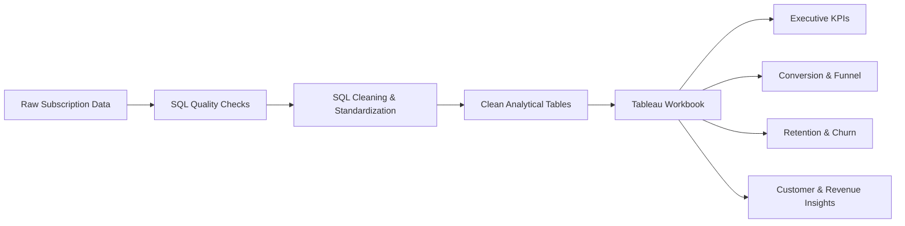

# 📊 Subscription Product Analytics

> **End-to-end subscription analytics project using SQL for data quality & cleaning and Tableau for analysis, visualization, and business insights.**

[](#-sql-data-quality--cleaning)
[](#-tableau-analysis)
[](#)

---

## 📌 Table of Contents

- [Overview](#-overview)
- [Project Workflow](#-project-workflow)
- [Repository Structure](#-repository-structure)
- [SQL Data Quality & Cleaning](#-sql-data-quality--cleaning)
- [Tableau Analysis](#-tableau-analysis)
- [Dashboard Coverage](#-dashboard-coverage)
- [How to Use the Project](#-how-to-use-the-project)
- [Data Flow](#-data-flow)
- [Key Analytical Areas](#-key-analytical-areas)
- [Project Scope](#-project-scope)
- [Tools Used](#-tools-used)
- [Portfolio Value](#-portfolio-value)

---

## 🎯 Overview

This project demonstrates a practical **subscription product analytics workflow**.

The project is intentionally separated into two layers:

1. **SQL** → data quality checks, cleaning, type standardization, null handling, and preparation.
2. **Tableau** → KPI reporting, trends, funnel analysis, conversion, churn, revenue-related metrics, and cohort retention.

### Business questions explored

- How many users are signing up over time?
- How many users start trials and become paid customers?
- Where are users dropping in the subscription funnel?
- Which acquisition channels have stronger conversion?
- How does conversion differ by country and device?
- What does the customer base look like across plans?
- How are churn and lost recurring revenue represented?
- How does customer retention behave across cohorts?

---

## 🔄 Project Workflow



<details>
<summary><strong>Click to expand the workflow</strong></summary>

### Layer 1 — SQL

SQL is used only for preparing reliable analytical data:

- Duplicate checks
- Null checks
- Invalid date checks
- Price validation
- Experiment flag validation
- Funnel sanity checks
- Type casting
- Text cleanup
- Invalid-value handling
- Creation of stable cleaned tables

### Layer 2 — Tableau

The cleaned data is then used in Tableau for the analytical and visualization layer:

- Executive KPIs
- Signup trends
- Conversion analysis
- Subscription funnel
- Active customers
- Churn
- Cohort retention
- Acquisition/channel analysis
- Country analysis
- Device analysis
- Revenue / MRR-related metrics

</details>

---

## 📁 Repository Structure

```text
Subscription-Product-Analytics/
│
├── data/
│   ├── raw/
│   │   └── README.md
│   │
│   ├── cleaned/
│   │   └── README.md
│   │
│   └── tableau_extracts/
│       ├── README.md
│       └── *.hyper
│
├── sql/
│   ├── 01_data_quality.sql
│   ├── 02_cleaning.sql
│   └── README.md
│
├── tableau/
│   ├── subscription_product_analytics_FINAL.twb
│   ├── subscription_product_analytics_FINAL.twbx
│   └── README.md
│
└── README.md
```

<details>
<summary><strong>📂 Folder guide</strong></summary>

| Folder | Purpose |
|---|---|
| `data/raw/` | Raw/source data documentation |
| `data/cleaned/` | Documentation for cleaned analytical data |
| `data/tableau_extracts/` | Tableau extract files used by the workbook |
| `sql/` | SQL data quality and cleaning scripts |
| `tableau/` | Tableau workbook and packaged workbook |
| `README.md` | Project documentation |

</details>

---

## 🧹 SQL Data Quality & Cleaning

The SQL layer deliberately focuses on **data preparation rather than business reporting**.

### `01_data_quality.sql`

Performs QA checks for:

- Duplicate users
- Missing critical user fields
- Duplicate subscriptions
- Invalid subscription dates
- Negative monthly prices
- Experiment flag combinations
- Funnel-stage sanity

### `02_cleaning.sql`

Creates cleaned tables while preserving the raw inputs.

Cleaning includes:

- Removing duplicate records with `DISTINCT`
- Casting IDs to integer
- Casting dates to date types
- Trimming text fields
- Converting blank text values to `NULL`
- Handling invalid negative engagement values
- Validating binary flags
- Handling invalid negative prices/revenue
- Excluding records without required user/subscription IDs

### Clean analytical tables

```text
clean.users
clean.subscriptions
clean.experiment_dataset
clean.funnel_stages
```

> **Important:** SQL is not used here to build the dashboard analysis. Its role is data quality, cleaning, and preparation.

---

## 📊 Tableau Analysis

The Tableau workbook is the **main analytical layer** of the project.

### Tableau dashboards

The workbook contains two dashboards:

1. **Executive Overview**
2. **Customer & Retention Insights**

<details>
<summary><strong>📈 Executive Overview</strong></summary>

The executive layer provides a high-level view of subscription performance, including:

- Total users
- Trial users
- Paid users
- Paid conversion rate
- Churn rate
- MRR lost
- Monthly signup trend
- Subscription funnel
- Conversion breakdowns

</details>

<details>
<summary><strong>👥 Customer & Retention Insights</strong></summary>

The customer and retention layer focuses on:

- Active customers
- Churn by plan
- Cohort retention
- Customer segmentation by acquisition channel
- Country performance
- Device performance

</details>

---

## 📋 Dashboard Coverage

| Analysis | Tableau Worksheet |
|---|---|
| Total Users | `KPI - Total Users` |
| Trial Users | `KPI - Trial Users` |
| Paid Users | `KPI - Paid Users` |
| Paid Conversion Rate | `KPI - Paid Conversion Rate` |
| Churn Rate | `KPI - Churn Rate` |
| MRR Lost | `MRR Lost KPI` |
| Signup Trend | `Monthly Signup Trend` |
| Subscription Funnel | `Subscription Funnel` |
| Active Customers | `Active Customers` |
| Churn by Plan | `Churn by Plan` |
| Cohort Retention | `Cohort Retention` |
| Acquisition Channel Conversion | `Conversion by Acquisition Channel` |
| Country Conversion | `Conversion by Country` |
| Device Conversion | `Conversion by Device` |

---

## ▶️ How to Use the Project

### 1. Clone the repository

```bash
git clone <YOUR_GITHUB_REPOSITORY_URL>
cd Subscription-Product-Analytics
```

### 2. Review the SQL layer

Open:

```text
sql/01_data_quality.sql
sql/02_cleaning.sql
```

The scripts are written in a **PostgreSQL-compatible style**.

> Update the `raw.*` table references to match your staging/database schema before execution.

### 3. Run the data-quality checks

Execute:

```text
sql/01_data_quality.sql
```

Review duplicate, null, date, price, flag, and funnel issues.

### 4. Run the cleaning script

Execute:

```text
sql/02_cleaning.sql
```

This creates the cleaned analytical tables under the `clean` schema.

### 5. Open Tableau

For the easiest portfolio review, open:

```text
tableau/subscription_product_analytics_FINAL.twbx
```

The `.twbx` packaged workbook is the recommended file for sharing because it packages the Tableau workbook with its associated extracts.

---

## 🔗 Data Flow

```text
                 ┌───────────────────┐
                 │     RAW DATA      │
                 └─────────┬─────────┘
                           │
                           ▼
                 ┌───────────────────┐
                 │   SQL QA CHECKS   │
                 │ duplicates/nulls  │
                 │ dates/prices/etc. │
                 └─────────┬─────────┘
                           │
                           ▼
                 ┌───────────────────┐
                 │   SQL CLEANING    │
                 │ types/text/flags  │
                 │ invalid values    │
                 └─────────┬─────────┘
                           │
                           ▼
                 ┌───────────────────┐
                 │ CLEAN ANALYTICAL  │
                 │      TABLES       │
                 └─────────┬─────────┘
                           │
                           ▼
                 ┌───────────────────┐
                 │      TABLEAU      │
                 │ KPIs • Funnel     │
                 │ Conversion        │
                 │ Churn • Retention │
                 │ Customer insights │
                 └───────────────────┘
```

---

## 🔍 Key Analytical Areas

### 📈 Acquisition & Signup

Understand signup volume and conversion differences across:

- Acquisition channels
- Countries
- Devices

### 🔄 Subscription Funnel

Track the progression from:

```text
Users
  ↓
Trial Started
  ↓
Converted / Paid
  ↓
Retained
```

### 💳 Subscription & Revenue

The Tableau layer includes subscription and revenue-related reporting such as:

- Paid customers
- Active customers
- Monthly recurring revenue-related metrics
- Lost MRR
- Plan-level churn

### ♻️ Retention

Cohort analysis is handled in Tableau to understand how retention changes across customer signup cohorts.

---

## 🎯 Project Scope

This project is intentionally kept as a **clean SQL + Tableau analytics portfolio project**.

### SQL is responsible for

✅ Data quality  
✅ Data cleaning  
✅ Standardization  
✅ Validation  
✅ Analytical table preparation  

### Tableau is responsible for

✅ KPI reporting  
✅ Charts and dashboards  
✅ Conversion analysis  
✅ Funnel analysis  
✅ Churn analysis  
✅ Cohort retention  
✅ Customer analysis  
✅ Acquisition/channel analysis  
✅ Country/device breakdowns  
✅ Revenue/MRR-related reporting  

### Not included

❌ Python analytics pipeline  
❌ Machine-learning models  
❌ Separate statistical experimentation notebook  
❌ A second BI tool duplicating Tableau  
❌ Business analysis hidden inside the SQL cleaning layer  

This separation keeps the project easy to understand and demonstrates a realistic analytics workflow.

---

## 🛠️ Tools Used

| Tool | Purpose |
|---|---|
| **SQL / PostgreSQL-style SQL** | Data quality and cleaning |
| **Tableau** | Analysis, visualization, and dashboards |
| **Tableau Hyper** | Packaged analytical extracts |
| **Git / GitHub** | Version control and portfolio presentation |

---

## 💼 Portfolio Value

This project demonstrates an end-to-end analytics workflow:

> **Raw Data → Data Quality → SQL Cleaning → Analytical Data → Tableau → Business Insights**

It is designed to show practical skills in:

- Data cleaning
- SQL validation
- Analytical data preparation
- Tableau dashboard development
- Subscription analytics
- Conversion analysis
- Funnel analysis
- Churn analysis
- Cohort retention
- KPI reporting
- Business-oriented visualization

---

## 📎 Main Deliverable

**Recommended Tableau file:**

```text
tableau/subscription_product_analytics_FINAL.twbx
```

Open the packaged workbook in **Tableau Desktop** to explore the dashboards and worksheets.

---

## 👤 Author

**Shil Gawande**

> Data Analytics Portfolio Project — Subscription Product Analytics

---

⭐ If this project is useful, consider starring the repository.

